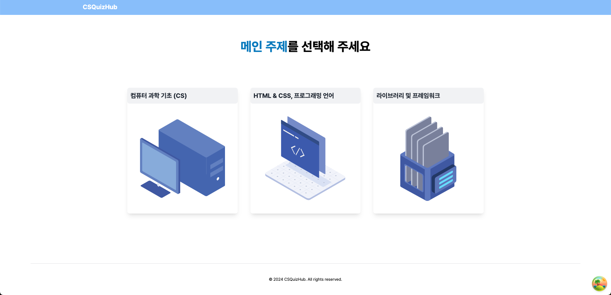
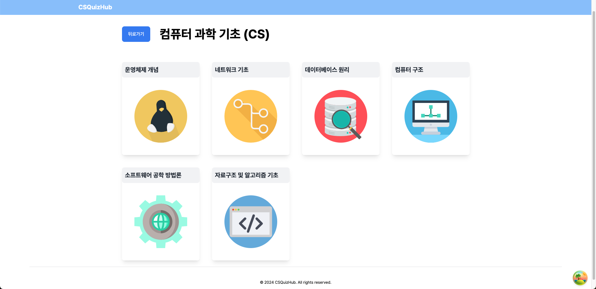
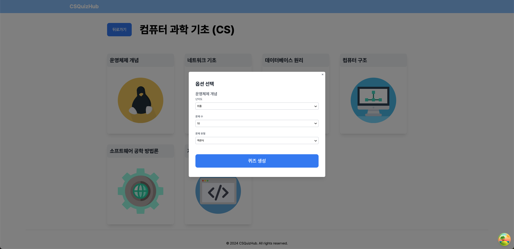

# ai-quiz

## 프로젝트 개요

**CS 면접, 이제 게임처럼 준비하세요!**

AI 기반 퀴즈 플랫폼으로 CS 지식을 재미있게 테스트하고 향상시킬 수 있습니다.

 

이 프로젝트는 `Open AI API`를 활용하여 면접 문제를 자동으로 생성하고, 이를 대화형 퀴즈 형태로 제공하는 애플리케이션입니다.  
사용자들은 이 애플리케이션을 통해 CS 면접 준비를 효과적으로 할 수 있으며, 다양한 주제에 대한 지식을 테스트하고 향상시킬 수 있습니다.

 

## 사용 기술

 

## 구현사항

### 주제 선택 페이지

|  |
| ----------------------------------- |
|    |
|     |

### 미완료 사항

- [x] 퀴즈 문제 생성 모달
- [ ] 퀴즈 풀이 페이지
- [ ] 퀴즈 결과 페이지
- [ ] 백엔드 api(topic 데이터) 구현

 

### 현재까지 완료한 사항

- Step component, hooks 생성
  - 퀴즈 풀이에서 재사용 가능하도록 구현
- CreatePortal 사용하여 Modal 구현
- msw로 api 데이터 mocking
